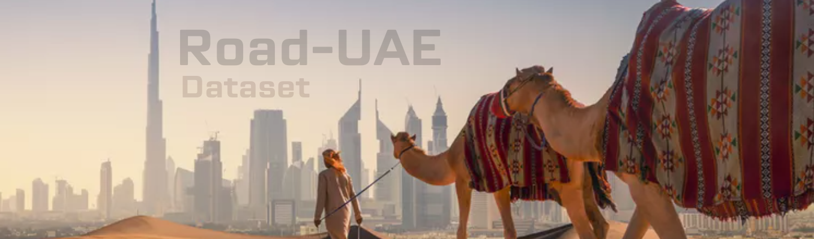

# [Road-UAE Dataset](https://avlab.io/road-uae/)
ROAD-UAE is a richly annotated dataset containing detailed semantic annotations for road agents and events. With 57 minutes of continuous footage, each video segment lasts between 2.5 to 3 minutes. The dataset includes heterogenous annotations for three main agent categories: people (pedestrians and cyclists), vehicles (divided into six classes), and traffic lights. It captures the unique road topology and traffic conditions of the Gulf Region, offering consistent tracking IDs for all road agents. Additionally, it provides action annotations as "action tubes" and road event detections labeled as triplets (Agent, Action, Location) at the frame level.

# [Off-Road Open Desert Trail Detection (O2DTD) Dataset](datasets/offroad)
O2DTD is the first dataset on desert freespace detection, collected with six       different light conditions (dawn, morning, afternoon, sunset, twilight, and night), containing a total of 5,045 RGB images.

# [Khalifa University's Autonomous Shuttle (KUAS) Dataset](datasets/shuttle)
The dataset includes around twenty minutes of unlabeled data (A set of 8 LiDARs, Monochrome Cameras, IMU, GPS) captured from an Autonomous Shuttle that is deployed and operated in Khalifa University, SAN Campus, UAE.

All datasets  are copyrighted under the <a rel="license" href="http://creativecommons.org/licenses/by-nc-sa/3.0/">Creative Commons Attribution-NonCommercial-ShareAlike 3.0</a> License. 
